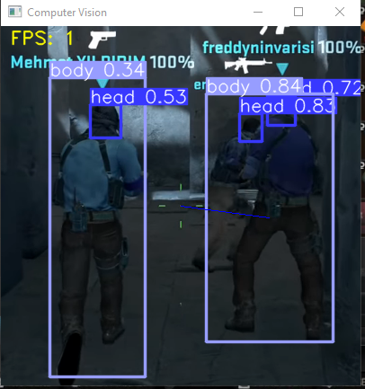

# Yolov5 Aim Assistant
  
  ## Description 
  This program serves as my own introduction into the world of machine learning and object detection. It is not meant to be used in game due to hardware restrictions and reliability. That being said, I learned quite a bit in writing these few lines of code, and it has sparked my interest in the world of machine learning.

  Utilizing Yolov5 and PyTorch with CUDA enabled, I was able to get around 30-40 frames per second on a 1050TI with this script and was able to hit some surprising shots on standing targets. The mouse movement method isn't perfect, nor is anything really, but I am excited to improve it in the future.

  ## Table of Contents
  * [Installation](#installation)
  * [Usage](#usage)
  * [Examples](#examples)
  * [Questions](#questions)

  ## Installation 
  Clone repository and install all dependencies. This includes cloning Yolov5 to your chosen directory and isntalling PyTorch with CUDA support to utilize GPU acceleration with supported NVIDIA GPUs. Create a virtual environment and install any and all other dependencies. 

  ## Usage 
  Turn off raw mouse input in CS:GO and press Z when you want the program to move your mouse to a possible detection. I have found a 2.5-3.0 sensitivity with 800 DPI in game for more consistent results. 

  ## Example

  

  ## Questions
  If you have any questions about this projects, please contact me directly at jonathanwthompson98@gmail.com. You can view more of my projects at https://github.com/jonnyfromralphs.
